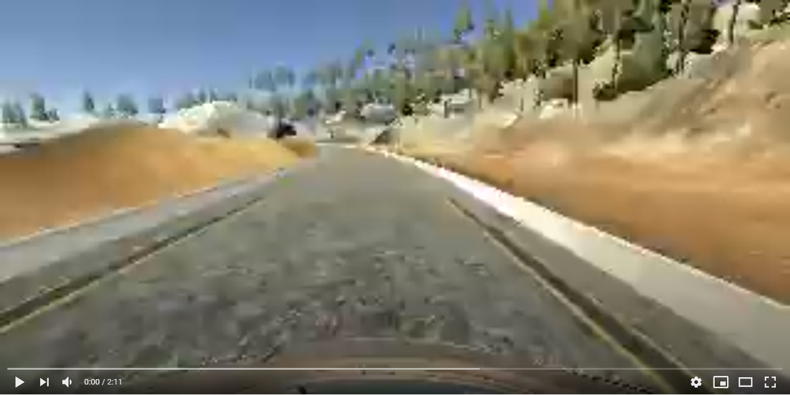

# Behavioral Cloning for Autonomous Vehicles

[](http://www.udacity.com/drive)

## Overview
This repository contains files for **cloning a human driver's behavior** and training an autonomous vehicle to imitate that behaviour.

Deep neural networks and convolutional neural networks are used to clone the driving behavior. With input from camera data, the network will output steering angles for an autonomous vehicle. The model is built, trained, validated and tested using Keras.

For data collection, a car can be steered around a track in a simulator. Collected image data and steering angles are used to train the neural network. Then this model is used to drive the car autonomously around the track - again in the simulator. Here is the result:

[](https://youtu.be/xgAVLis9y-E)

## The Project
The steps are the following:
* Use the simulator to drive the car around and collect data of good driving behavior
* Design, train and validate a model that predicts a steering angle from image data
* Use the model to drive the vehicle autonomously around in the simulator

## Details About Files In This Repository
### `drive.py`

Usage of `drive.py` requires a trained convolution neural network to be saved as an h5 file `model.h5`. See the [Keras documentation](https://keras.io/getting-started/faq/#how-can-i-save-a-keras-model) for how to create this file using the following command:
```sh
model.save(filepath)
```

Once the model has been saved, it can be used with drive.py using this command:

```sh
python drive.py model.h5
```

The above command will load the trained model and use the model to make predictions on individual images in real-time and send the predicted angle back to the server via a websocket connection.

#### Saving a video of the autonomous agent

```sh
python drive.py model.h5 run1
```

The fourth argument, `run1`, is the directory in which to save the images seen by the agent. If the directory already exists, it'll be overwritten.

```sh
ls run1

[2017-01-09 16:10:23 EST]  12KiB 2017_01_09_21_10_23_424.jpg
[2017-01-09 16:10:23 EST]  12KiB 2017_01_09_21_10_23_451.jpg
[2017-01-09 16:10:23 EST]  12KiB 2017_01_09_21_10_23_477.jpg
[2017-01-09 16:10:23 EST]  12KiB 2017_01_09_21_10_23_528.jpg
[2017-01-09 16:10:23 EST]  12KiB 2017_01_09_21_10_23_573.jpg
[2017-01-09 16:10:23 EST]  12KiB 2017_01_09_21_10_23_618.jpg
[2017-01-09 16:10:23 EST]  12KiB 2017_01_09_21_10_23_697.jpg
[2017-01-09 16:10:23 EST]  12KiB 2017_01_09_21_10_23_723.jpg
[2017-01-09 16:10:23 EST]  12KiB 2017_01_09_21_10_23_749.jpg
[2017-01-09 16:10:23 EST]  12KiB 2017_01_09_21_10_23_817.jpg
...
```

The image file name is a timestamp of when the image was seen. This information is used by `video.py` to create a chronological video of the agent driving.

### `video.py`

```sh
python video.py run1
```

Creates a video based on images found in the `run1` directory. The name of the video will be the name of the directory followed by `'.mp4'`, so, in this case the video will be `run1.mp4`.

Optionally, one can specify the FPS (frames per second) of the video:

```sh
python video.py run1 --fps 48
```

Will run the video at 48 FPS. The default FPS is 60.

### `model.py`

The model.py file contains the code for training and saving the convolution neural network. The file shows the pipeline used for training and validating the model and it contains comments to explain how the code works.

### Model Architecture and Training Strategy

#### 1. Model architecture

![alt text][image9]
![alt text][image10]

The model consists of a convolution neural network with 5x5 and 3x3 filter sizes and depths between 3 and 64 (model.py lines 76-86) 

The data is normalized in the model using a Keras lambda layer (code line 76). 

#### 2. Attempts to reduce overfitting in the model

The model was trained and validated on different data sets to ensure that the model is not overfitting. Dropout layers where added. Dropout consists in randomly setting a fraction rate of input units to 0 at each update during training time, which helps prevent overfitting. The model was tested by running it through the simulator and ensuring that the vehicle could stay on the track.

#### 3. Model parameter tuning

The model uses an adam optimizer, so the learning rate was not tuned manually (model.py line 90).

#### 4. Appropriate training data

Training data was chosen to keep the vehicle driving on the road. I used a combination of center lane driving, recovering from the left and right sides of the road (offcenter-to-center driving/recovery driving) and counterclockwise-driving which is realized by data augmentation (flipping images vertically) (model.py code lines 51-56). I flipped images and angles (multiplying by -1.0).

#### 5. Creation of the Training Set & Training Process

To capture good driving behavior, I first recorded two laps on track one using center lane driving.

I then recorded the vehicle recovering from the left side and right sides of the road back to center so that the vehicle would learn to get back on track if this occurs while driving autonomously.

I finally randomly shuffled the data set and put 20% of the data into a validation set. 

I used this training data for training the model. The validation set helped determine if the model was over- or underfitting. The ideal number of epochs was 5.

[//]: # (Image References)

[image1]: ./examples/placeholder.png "Model Visualization"
[image2]: ./examples/placeholder.png "Grayscaling"
[image3]: ./examples/placeholder_small.png "Recovery Image"
[image4]: ./examples/placeholder_small.png "Recovery Image"
[image5]: ./examples/placeholder_small.png "Recovery Image"
[image6]: ./examples/placeholder_small.png "Normal Image"
[image7]: ./examples/placeholder_small.png "Flipped Image"
[image8]: ./examples/Thumbnail.png "Thumbnail"
[image9]: ./examples/network_architecture.png "Architecture"
[image10]: ./examples/cnn-architecture-624x890.png "CNN Architecture"
